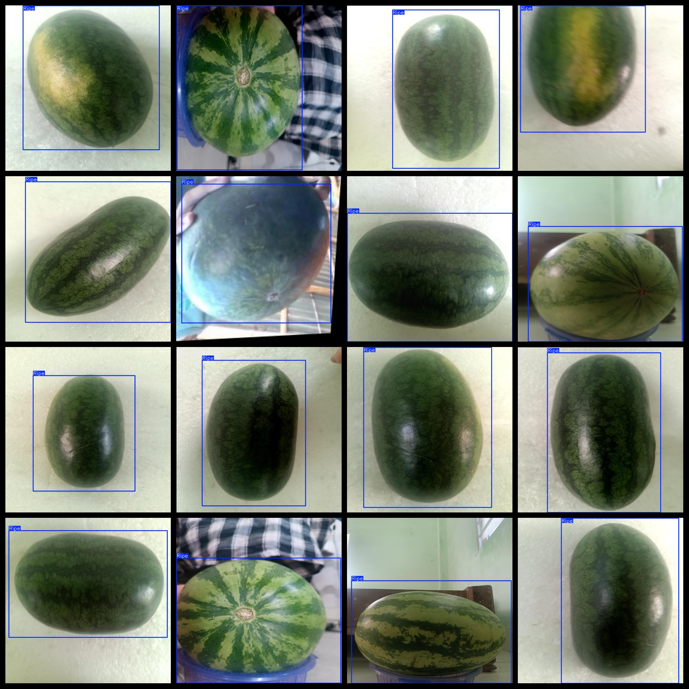

# Watermelon Ripeness Detection Dataset 4406 imagesVOC+YOLO format

The Watermelon Ripenness Detection Dataset consists of 4406 images in the VOC+YOLO format. The dataset is organized into three folders: JPEGImages, Annotations, and labels. The JPEGImages folder contains a total of 4406 JPEG images, while the Annotations folder contains a total of 4406 XML files. Additionally, the labels folder contains a total of 4406 txt files.

There are two label categories: "Ripe" and "Unripe". The number of boxes (in yolo format) for each category is as follows:

- Ripe boxes = 4545
- Unripe boxes = 212

Total boxes = 4757

The images are of high resolution (pixels). They have not been enhanced.

The GitHub repository location is datasets_sl.

The shape of the labels is rectangular boxes, used for object detection recognition.

It is important to note that there is no guarantee for the accuracy or precision of the trained models or weight files. The dataset provides accurate and reasonable annotations.

The annotations and image details are as follows:

## Images

---

Here is a pay link on Stripe (https://buy.stripe.com/3cs8yP7sY87d0vu9AB). Please contact me lonlonago@foxmail.com after funding $89, and I will send you a complete data files, thank you!

